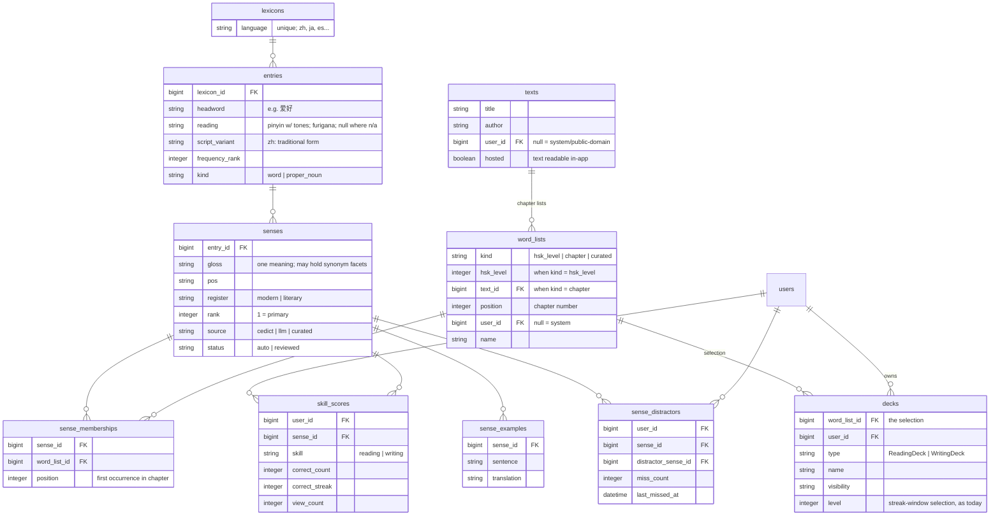

# Compendium

Design for a single shared vocabulary store ("the compendium") that all language
decks select from, replacing per-deck language data_sets. Status: **design only —
nothing app-side is built.** The content pipeline was prototyped against real
texts in 2026-08 (see Prototype findings).

## Goals

- One canonical record per word per language. Fixing a gloss fixes it everywhere.
- Decks are *selections over* the compendium, not owners of copied content.
- Progress belongs to the user × word-sense × skill, independent of deck. Studying
  a word in any deck advances the same streak; reading and writing streaks are
  separate.
- Support texts as a first-class source: a book's chapters become word lists, so a
  reader can study a chapter's vocabulary before reading it.
- Multi-language from the start (Mandarin first). Language-specific needs live in
  nullable columns, not Mandarin-shaped tables.
- Sharing by reference: a shared deck is a visibility flag, not a copied data_set.

## Schema

Key uniques:

| Table | Unique on |
|---|---|
| entries | (lexicon_id, headword, reading) |
| senses | — (rank orders within entry) |
| sense_memberships | (sense_id, word_list_id) |
| skill_scores | (user_id, sense_id, skill) |
| sense_distractors | (user_id, sense_id, distractor_sense_id) |

## Core concepts

### Entry vs. sense

- **Entry** identity is headword + reading within a lexicon. 还 hái and 还 huán are
  two entries; 花 huā is one entry regardless of meaning.
- **Sense** is the studyable unit — one meaning of an entry. The split criterion:
  *could a learner know one meaning without knowing the other?* 花 flower vs.
  花 to-spend split; "to like" vs. "to be fond of" do not (synonym facets stay
  inside one sense's gloss).
- Over-splitting is tolerated (the seed data is already semicolon-split and can be
  imported as-is). Credit fan-out (below) makes facet-level rows score in lockstep,
  and merging senses later is a local fix: combine rows, keep the max score. The
  cost is cosmetic — inflated "sense counts" on entries.
- Script is a column, not an entry split: simplified is the headword, traditional
  is `script_variant` (per-sense mapping is unambiguous even for one-to-many
  characters like 发, because senses pin the word). Regional *vocabulary*
  differences (软件 vs. 軟體) are separate entries, not script variants.
- Proper nouns (`kind`) are excluded from general vocabulary lists (HSK,
  curated) but belong in text lists: studying to read a chapter means no token
  should be a blank. Name glosses are text-contextual ("Guo Jing — the
  protagonist"), which the pipeline's contextual glossing step produces anyway,
  and progress on a name carries across chapters and sequels like any sense.
  `kind` is presentation metadata (a name badge, maybe a lighter study
  treatment), not a compendium filter. Function words enter text lists on the
  same no-blanks basis, glossed as function ("的 — possessive marker") — weak
  cards that teach recognition rather than mastery, but a weak card beats a
  blank, and past the earliest levels they're already mastered and drop out of
  study on their own. The same logic keeps compositional-but-dictionary-listed
  collocations (不再, 几天) in lists: common-phrase reinforcement beats filtering,
  streaks retire them fast, and the only requirement is that their glosses are
  verified correct — no triviality filter.
- `register` keeps literary/archaic senses (e.g. from Journey to the West) from
  polluting modern decks, and vice versa.

### Deck = word_list × form

A deck owns no content: it points at a word_list (HSK level, book chapter, or a
hand-curated list) and contributes the *form* — reading vs. writing (existing STI),
plus study settings. Consequences:

- Sharing a deck is a visibility flag. No copying, no forking of content on add.
  Fork = copy the word_list, only needed to *edit* the selection.
- HSK levels, chapters, and personal lists are one mechanism.
- The current `data_sets`/`items`/`pairings`/`cards` tables are not needed for
  language decks. (Basic and Music decks stay on that machinery for now — their
  progress model is similar but their source data is not; schema follow-up needed.
  No polymorphic tables.)
- Users never author gloss content into the compendium. A language deck is
  created by selecting existing words/lists, or by supplying words or a text
  that run the content pipeline (senses CEDICT-grounded and LLM-generated).
  Freeform front/back uploads are Basic decks — full freedom, no lexicon
  contact.

### Study semantics

- **One card per entry per deck.** If a deck's list contains several senses of one
  entry, study mode presents a single card whose back is the union of those
  senses' glosses, rejoined with "; " — the same display as today. The deck itself
  is the disambiguating context for the prompt (seeing 花 in an HSK 1 deck asks
  for what HSK 1 taught).
- **Credit fans out.** Answering that card correctly advances the streak of every
  member sense. Grouping is a study-time construct; nothing about it is stored.
- **A card studies at the level of its weakest member sense.** A card mixing a
  mastered and a new sense behaves like a new card. (No time-based scheduling —
  selection stays streak-based, as today; a `last_studied_at` on skill_scores is
  a trivial later addition if spaced repetition ever arrives.)
- **Grading is member-scoped.** A typed or chosen answer is checked against the
  union of the card's member senses — the same set the card displays. Multiple
  choice and fuzzy find both target this union (fuzzy find matches the full
  joined gloss, not one sense). Synonym-facet safety comes from seeding, not
  grading: facets semicolon-split from one seed row enter lists together, so
  they are usually co-members. A narrow chapter list that links only one facet
  will mark a synonym facet wrong — accepted; the chapter taught a specific
  usage.
- **Distractors are generated; misses are remembered.** No curated distractor
  lists for language decks: option lists build on the fly from sibling entries in
  the deck (length-matched, register permitting). When a user picks a wrong
  option, every member sense the card displayed is linked to every member sense
  the chosen option displayed — cross-product fan-out, mirroring credit fan-out,
  because the displayed grouping is deck-contextual and not stored. Rows are
  per-user (sense_distractors) with a miss count; accumulated misses bias future
  option selection toward that user's actual confusions. A global
  "commonly confused" signal can be derived later by aggregating across users.
- **Cards are not rows.** A study session enumerates the list's senses, joins the
  user's skill_scores for the deck's skill, and applies the existing
  level/streak-window selection. Any user can study any visible deck; their
  progress is their own. Deck-level recency (`decks.last_studied_at`) stays where
  it is, as today.

### Progress

`skill_scores` is per user × sense × skill. Reading and writing advance
independently; both persist across every deck containing the sense.

Known wrinkle, deliberately deferred: writing ability is arguably per *entry* (or
per character — writing 银行 is writing 银 + 行) rather than per sense. Keying both
skills to sense is the consistent v1; revisit if writing decks feel wrong.

### Examples

`sense_examples` holds teaching sentences only, shown on card reveal (today's
items.example / paired_example). Rows enter solely from trusted sources —
seed-account curation, Tatoeba, generated sentences — so everything in the table
is shareable by construction; no flag needed. Quoted-from-text occurrence
evidence is a separate, deferred concept (see Open questions).

## Content pipeline (build-time, per text or list)

1. **Segment** the text into words — LLM segmentation (Sonnet-class, sentences
   batched), **mechanically verified**: the tokens joined back together must
   reproduce the sentence's Han characters exactly (punctuation and quote-glyph
   normalization ignored — the only failure mode ever observed). The check
   guarantees partition *integrity* — no character dropped, invented, or
   substituted — NOT boundary correctness; boundaries are validated semantically
   downstream (steps 4–5). Failed sentences retry singly; a deterministic floor
   (character-level tokens, or jieba) exists but went unreached in prototype
   runs — 517/517 sentences across both registers verified. This handles modern
   and classical text with one mechanism (jieba's classical welds — 故曰, 谓之 —
   don't occur); classical texts stay deferred on deck economics alone (~900 new
   studyable words per 西游记 chapter), no longer on segmentation.
2. **Lexicon lookup first** — known senses cost nothing and inherit user progress.
   Lookup indexes both headword and script_variant, so traditional and simplified
   sources both match. Pure-number tokens drop; era spellings with a modern form
   (甚么 → 什么) map as variants.
3. **New words → contextual glossing**: the LLM receives the sentence plus the
   CC-CEDICT entry and picks/trims the sense that fits. CEDICT (a ~9 MB reference
   table server-side, never user-facing) is there for gloss *convergence*, cheap
   verification, the not-a-word tripwire, and pinyin — not because the LLM can't
   translate.
4. **Match step**: which existing sense does this usage select? Selection is the
   real question (memberships attach at the sense level, and picking the sense
   resolves homograph readings as a side effect); measured at 100% for
   same-reading splits, ~96% when a tone-pair reading is at stake (see Prototype
   findings). If no sense fits, create one (source: llm, status: auto), with
   `register` set from the text's context so literary senses stay out of modern
   decks. The sense inventory grows lazily from real usage.
5. **Misses route, they don't fail**: not-in-CEDICT means proper noun (→ into
   the chapter list, glossed contextually), segmentation artifact (→ re-segment
   check), or a real rare word
   (→ ungrounded gloss with heavier checks: "real word / name / artifact?" asked
   explicitly, cross-occurrence agreement, back-translation, review queue).
6. **Propose → confirm**: every LLM assertion (new-sense claims, glosses, miss
   routing) is proposed by one model and independently confirmed by a tier-above
   judge, calibrated to actually reject — the flash-csvs pattern. Prototype rates:
   ~43% of new-sense proposals rejected on modern text, ~10% of glosses fixed.
   Nothing enters the compendium on a single model's say-so.
7. **Chapter word_lists** get sense_memberships with first-occurrence positions;
   dedup against earlier chapters happens by construction (the sense already
   exists and the user may already have scores).

Because step 1 verifies integrity but not boundaries, boundary errors are the one
class that reaches later stages, and each kind meets a net: an over-merge either
fails lookup (→ routed as artifact) or accidentally forms a real dictionary word
(靠着火 → 着火) and then surfaces as a match-step proposal whose sense doesn't fit
the sentence — the confirm tier rejects it and feeds a re-segmentation check. An
over-split whose pieces are real words is the weakest-checked case: a piece whose
gloss clashes with the context still trips the match step, but a contextually
plausible split passes silently — worst case an *omitted* compound card, never a
wrong one. (Under jieba segmentation these welds were common and the machinery
below existed to fight them — a deterministic "verified pre-split" stage plus
weld-pattern rules; LLM segmentation produced none of the dangerous welds in
either test text, so that stage is retired. See Prototype findings.)

## Prototype findings (2026-08)

A throwaway prototype ([compendium_prototype/](compendium_prototype/); claude-CLI
scripts in the flash-csvs idiom, intermediates regenerate into tmp/) ran the full
content pipeline — segment → lookup →
pre-split → gloss/match/route (Sonnet) → confirm (Opus) — over two public-domain
texts, with the HSK 1–7 deck standing in as the lexicon:

- **孔乙己 (Lu Xun, 1919 — modern)**: 1,382 tokens, 605 studyable words; 75% of
  tokens already on HSK cards; ~200-word new-vocab chapter deck. After confirm,
  8.8% of known words genuinely needed a new sense (散 "knock off work", 文 the
  coin, 道 "said"). Pre-split killed 57/137 CEDICT misses, all correctly. This is
  the product the doc describes, working.
- **西游记 ch. 1 (Ming)**: under jieba, token coverage 49%; 719 CEDICT misses,
  mostly welded classical function words; ~900 new words in one chapter. Glossing
  judgment held up fully (earthly-branch senses of 子/丑/未, classical 也, cípái
  titles, 须菩提 as Subhuti) — the blockers were segmentation (since solved, next
  bullet) and deck economics, which alone sustains the classical deferral.
- **LLM vs jieba segmentation** (`01b-segment-llm.rb` + `05-seg-diff.rb`): Sonnet
  segments sentences under the Han-reconstruction check — 517/517 sentences
  verified across both texts once quote-glyph normalization (the only failure
  cause ever logged; zero Han-content errors) was excluded from comparison.
  Unique-word miss rate: modern 21.6% → 6.5%, classical 42.5% → 17.9%; none of
  the dangerous cross-boundary welds occurred; names and idioms arrive whole
  (咸亨酒店, 东胜神洲, 好喝懒做). The diff also exposed the deterministic
  pre-split over-firing on classical (三才, 万劫, 千岁 wrongly split by the
  number rule). Consequence: step 1 is LLM-primary; jieba and the pre-split
  stage are retired to a never-reached deterministic floor.
- **Full chain over LLM segmentation** (slug `kongyiji-llm`): machine-verifies
  the segmentation claims that the diff reports made by inspection. All 12
  match-step rejections were sense-nuance; zero were disguised boundary errors
  (the jieba baseline had 4). Routing found no real artifacts (2 verdicts, both
  overturned by the confirm tier as real words), no shrapnel-type misses, and
  match proposals were fewer and more precise than the jieba baseline (36 vs 56
  judged; 67% vs 57% confirm precision). Span-scoped re-segmentation repair is
  understood (boundary-shift errors implicate neighbors; artifact parts that
  don't resolve are the tell) but stays unbuilt — no observed need.
- **Sense selection** (`06-sense-select.rb`): the match step's "which sense?"
  judgment, measured against flash-csvs ground truth (85 multi-level headwords
  with disjoint glosses × their judge-verified example sentences, 124 items).
  Sonnet single-pass: 96.8% overall; **100% on same-reading sense splits** — the
  case memberships and credit fan-out depend on; 95.6% on homograph/reading
  resolution, with all 4 misses being tone-pair readings whose senses nearly
  coincide (转 zhuǎn/zhuàn, 炸 fry/explode). No confirm tier needed for
  selection; adjacent-sense homographs are the only escalation candidates.
- **Entry resolution** (`resolve.rb`, read-only dry run of migration step 3):
  100% of dev-DB zh fronts resolve cleanly by headword + reading, with a toneless
  fallback absorbing sandhi differences. Production run still pending — dev data
  is mostly the seed resolving against itself, so the risky buckets
  (reading_mismatch, unresolved) never fired.

Net: every LLM judgment in the pipeline is now measured — segmentation
(mechanically verified), sense creation (propose→confirm), glossing, routing,
and sense selection. Still untested: study-time semantics (credit fan-out, card
grouping), which are ordinary app code, and cross-chapter lexicon growth over a
full book.

## Seeding

- The existing hand-curated HSK data_sets are the seed: vetted word + level +
  gloss rows. Their semicolon-split glosses import as individual senses (facet
  over-splitting accepted, see above).
- Cross-level gloss differences for the same headword are *signal* — HSK levels
  teach different senses of the same word (花 flower @1, spend @higher). Same
  meaning → merge; different meaning → separate senses with separate level
  memberships.
- HSK official lists carry no sentences or sense annotations; context for
  list-sourced words comes from Tatoeba, level-constrained LLM-generated
  sentences, or community datasets. (The curated decks canNOT double as an
  engine validation set — they are themselves output of the flash-csvs
  pipeline, so the diff would be circular. Engine validation came from the
  2026-08 text-prototype runs instead; see Prototype findings.)
- Useful community data: [drkameleon/complete-hsk-vocabulary](https://github.com/drkameleon/complete-hsk-vocabulary)
  (MIT; both HSK versions, frequency, POS, traditional, cleaned CEDICT glosses).

## Deck migration

1. **Seed first.** Entries and senses come from the curated HSK import (see
   Seeding), so most matching targets exist before any deck migrates.
2. **Catalog-derived data_sets collapse.** Every copy of a catalog HSK data_set —
   modified or not — maps to the shared system hsk_level word_list. Copy-era
   modifications are discarded (dumped to a migration log, not silently lost).
   Users edit selections, not senses; personal gloss edits have no home in the
   new model (per-user overrides are parked — see Open questions). This removes
   the premise of the copy-and-suggest-back catalog
   flow — its successor, if any, is sense-level edit proposals.
3. **Other LanguageDataSets become curated word_lists** owned by the same user.
   Each item resolves to an entry by headword + the card's stored reading
   (CEDICT fallback when reading is missing). The gloss's fate depends on whose
   data_set it is:
   - **Seed account** (the app owner's — a migration-time account list, not
     schema): glosses are trusted curation and import verbatim as senses
     (source: curated), same standing as the HSK seed.
   - **Anyone else**: the gloss is a matching hint only. Usages no existing
     sense covers get pipeline-generated senses (CEDICT-grounded, source: llm,
     status: auto); user wording never enters the lexicon. A data_set whose
     items mostly don't resolve to real words was never a language deck — it
     migrates as a Basic deck.
   - Items' example / paired_example follow the same trust split: seed-account
     examples import as sense_examples rows, fanned out to the same senses the
     item's gloss mapped to; other accounts' examples are dropped.
4. **Decks repoint** from data_set_id to word_list_id. Deck STI (Reading/
   Writing) is unchanged.
5. **Scores migrate last** (next section), once the card → sense mapping exists.

## Progress scoring migration

Existing card progress (`correct_count`, `correct_streak`, `view_count`) must move
to skill_scores keyed by the senses each card's item maps to (fan-out: a card
covering multiple glosses seeds each matched sense's row; conflicts keep max).
Deck type determines skill (ReadingDeck → reading, WritingDeck → writing).

## Open questions

- **Basic / Music progress**: same scoring shape, very different source data.
  Needs its own schema pass; explicitly not solved by this doc (and not via
  polymorphism).
- **Writing skill grain**: sense vs. entry vs. character (see wrinkle above).
- **Missed-words / tap-to-collect lists**: per-user dynamic word_lists (kind:
  missed?) — mechanism sketched, not designed.
- **Word_list governance**: who may edit a system list vs. a user list referenced
  by others' decks; deletion of referenced lists. More broadly, what a user may
  modify at all: current stance is selections yes, senses/glosses no — whether
  sense-level edit proposals ever earn a place is open.
- **Per-user gloss overrides**: parked. Gloss wording is the one fork-era freedom
  this model drops, and the Basic-deck escape hatch prices it at the entire
  language machinery (readings, fuzzy find, per-sense progress). Candidate
  design: (user, sense, wording) rows that change only that user's card display
  and grading acceptance — canonical senses, memberships, and progress untouched;
  a personal-mnemonic layer, and a signal source for edit proposals. Nothing in
  the schema blocks adding it later.
- **Gloss language**: glosses are English today; multi-gloss-language support
  would hang off senses later.
- **Occurrence evidence**: quoted-from-text sentences were cut from
  sense_examples — they belong to sense × text occurrence and inherit the text's
  copyright status. Two future consumers would revive them: auditing an LLM
  gloss against the sentence that produced it, and chapter pre-study context
  ("the sentence where chapter 3 uses this word"). Design when one exists.
