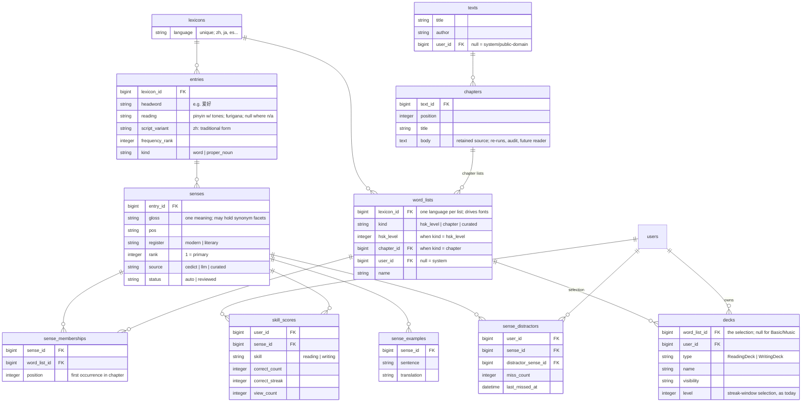

# Compendium

Design for a single shared vocabulary store ("the compendium") that all language
decks select from, replacing per-deck language content sets. Status: **phases
1–3 of Build sequencing are shipped** (2026-08: study-engine interface
extraction, the Basic/Music flat-card pass, then the language content freeze),
and phase 4 has begun with its 4.3 rename, taken out of order. Language content
is now read-only and `word_lists`/`items`/`pairings` are language-only and
static. The content pipeline was prototyped against real texts in 2026-08 (see
Prototype findings).

## Goals

- One canonical record per word per language. Fixing a gloss fixes it everywhere.
- Decks are *selections over* the compendium, not owners of copied content.
- Progress belongs to the user × word-sense × skill, independent of deck. Studying
  a word in any deck advances the same streak; reading and writing streaks are
  separate.
- Support texts as a first-class source: a book's chapters become word lists, so a
  reader can study a chapter's vocabulary before reading it.
- Multi-language from the start (Mandarin first). Language-specific needs live in
  nullable columns, not Mandarin-shaped tables.
- Sharing by reference: a shared deck is a visibility flag, not a copied word_list.

## Schema

Key uniques:

| Table | Unique on |
|---|---|
| entries | (lexicon_id, headword, reading) |
| chapters | (text_id, position) |
| senses | — (rank orders within entry) |
| sense_memberships | (sense_id, word_list_id) |
| skill_scores | (user_id, sense_id, skill) |
| sense_distractors | (user_id, sense_id, distractor_sense_id) |

## Core concepts

### Entry vs. sense

- **Entry** identity is headword + reading within a lexicon. 还 hái and 还 huán are
  two entries; 花 huā is one entry regardless of meaning.
- **Sense** is the studyable unit — one meaning of an entry. The split criterion:
  *could a learner know one meaning without knowing the other?* 花 flower vs.
  花 to-spend split; "to like" vs. "to be fond of" do not (synonym facets stay
  inside one sense's gloss).
- Over-splitting is tolerated (the seed data is already semicolon-split and can be
  imported as-is). Credit fan-out (below) makes facet-level rows score in lockstep,
  and merging senses later is a local fix: combine rows, keep the max score. The
  cost is cosmetic — inflated "sense counts" on entries.
- Script is a column, not an entry split: simplified is the headword, traditional
  is `script_variant` (per-sense mapping is unambiguous even for one-to-many
  characters like 发, because senses pin the word). Regional *vocabulary*
  differences (软件 vs. 軟體) are separate entries, not script variants.
- Proper nouns (`kind`) are excluded from general vocabulary lists (HSK,
  curated) but belong in text lists: studying to read a chapter means no token
  should be a blank. Name glosses are text-contextual ("Guo Jing — the
  protagonist"), which the pipeline's contextual glossing step produces anyway,
  and progress on a name carries across chapters and sequels like any sense.
  `kind` is presentation metadata (a name badge, maybe a lighter study
  treatment), not a compendium filter. Function words enter text lists on the
  same no-blanks basis, glossed as function ("的 — possessive marker") — weak
  cards that teach recognition rather than mastery, but a weak card beats a
  blank, and past the earliest levels they're already mastered and drop out of
  study on their own. The same logic keeps compositional-but-dictionary-listed
  collocations (不再, 几天) in lists: common-phrase reinforcement beats filtering,
  streaks retire them fast, and the only requirement is that their glosses are
  verified correct — no triviality filter.
- `register` keeps literary/archaic senses (e.g. from Journey to the West) from
  polluting modern decks, and vice versa.

### Homographs and the level marks

The HSK seed decks disguise homographs rather than holding them. When one level
teaches two readings of the same word, flash-csvs'
`09-emit.rb#disambiguate_fronts!` marks the less common reading's front: a
superscript tone digit where the readings differ only by tone (过 guò / 过⁰ guo),
a parenthesized reading otherwise (重 / 重 (chóng)). The mark exists only to
satisfy `items`' unique `(word_list_id, side, text)`.

Seed content holds **21 such rows** — 15 superscripts (过, 空, 处, 卷, 散, 吐, 挨,
担, 缝, 晃, 圈, 闷, 蒙, 拧, 呛) and 6 parenthesized readings (得, 重, 系, 调, 露,
大意) — across Levels 2–7. Every one is a real homograph whose meanings are bound
to its readings (卷 juǎn "to roll up" vs. juàn "examination paper"), so folding a
pair into one card under the common reading would teach something false. Two are
worth knowing individually: 露 carries *identical* glosses on both rows (lù and
lòu, "to reveal; to expose"), so it is one sense with two readings; and 圈 has
three readings across Levels 6–7, two of which collide inside Level 7.

The compendium needs no mark — 过 guò and 过 guo are two entries differing only
in `reading`, and `sense_memberships` lets both into one word_list. What remains
is a display problem, two cards in a deck sharing a front, and the interim
answer is to annotate rather than merge, **showing whichever field the question
isn't asking for**:

- translation question (levels 1, 3+): the prompt carries the reading
  (重 · chóng), which is what the stored mark conveys today;
- reading question (level 2): the reading is the answer, so the prompt carries
  the gloss instead (重 · "heavy" → zhòng).

Both stages stay unambiguous while the cards stay separate. Merging them is the
end state (see Study semantics) but belongs with headword grouping in phase 5;
annotation is the small correct thing to carry until then.

The annotation also needs the reading stage's decoy pool to **exclude
same-headword siblings**, or 过 would be offered with both `guò` and `guo` — the
twin card's true reading. That exclusion restores an invariant the current code
already documents: `Study#shared_character_decoys` notes that a single-character
prompt can never anchor, "a same-count sibling sharing its character would be
the prompt itself", which merging the fronts would otherwise falsify.

Retiring the marks happens **before** the entries rung, on today's structure
(see phase 4's pre-rungs), so that entries land with no display change at all.
It also means deleting `disambiguate_fronts!` upstream, or the next catalog
regeneration reintroduces them.

### Deck = word_list × form

A deck owns no content: it points at a word_list (HSK level, book chapter, or a
hand-curated list) and contributes the *form* — reading vs. writing (existing STI),
plus study settings. Consequences:

- Sharing a deck is a visibility flag. No copying, no forking of content on add:
  adding a shared deck creates the adder's own deck row over the same word_list
  (their own level and study settings). **Shipped at 3.6**, ahead of the rest of
  this model — `word_lists` were already the shared container, so it needed no
  schema. Fork = copy the word_list, only needed to *edit* the selection — and
  progress carries across a fork automatically, since scores key to senses, not
  lists.
- Shared lists are living selections: the owner's edits propagate to every
  referencing deck. Safe by construction — progress is keyed to user × sense,
  so list edits can't touch it, and since users never author glosses, a shared
  deck exposes only a selection over canonical senses (the moderation surface
  is list names).
- Revoking a share stops discovery only: the link and preview die, no new adds.
  Decks that already reference the word_list keep working — same outcome the
  old fork-on-add design gave, without the copy.
- HSK levels, chapters, and personal lists are one mechanism.
- The `word_lists`/`items`/`pairings` tables are not needed for language decks
  either, once decks select over the compendium. Basic and Music have already
  exited them onto flat deck-owned cards (phase 2, shipped), so the item
  machinery is language-only today.
- Users never author gloss content into the compendium. A language deck is
  created by selecting existing words/lists, or by supplying words or a text
  that run the content pipeline (senses CEDICT-grounded and LLM-generated).
  Freeform front/back uploads are Basic decks — full freedom, no lexicon
  contact. Note the phasing: phase 3 removed every authoring path at once, so
  only selection exists until phase 5 adds creation-by-pipeline. The freeze
  is not a staging area for the pipeline — it is the end-state rule, shipped
  early.

### Coexistence with Basic and Music

The compendium replaces `word_lists`/`items`/`pairings` for language decks;
Basic and Music exited that machinery first (phase 2, **shipped 2026-08**)
onto one shared flat model: cards own their content and their progress
directly (`deck_id`, front, back, category, reading, examples, the score
counts, plus a `card_distractors` table for uploaded and miss-recorded
decoys), no word_list indirection. The families differ by STI type and
validation (music backs must match the note format), not table structure. Two
study engines then run side by side — language decks enumerate word_list
senses joined to skill_scores, Basic/Music decks read cards with embedded
scores. Rules:

- **One flat card model for Basic and Music, not a schema each.** Basic is
  freeform: cards owning their content is the correct model, not legacy debt
  (the word_list/items/pairings indirection is language-shaped reuse
  machinery). Music takes the same shape — *not* a compendium echo, though its
  pitch inventory is small and canonical — because the deck's grouping is part
  of what's studied (notes as a group, sequences as windows of cards), so
  progress belongs to the note-in-deck, not the pitch. Pitch-keyed scores
  would let mastery in one deck pre-advance the same notes in another —
  exactly right for words, wrong for music. No shared scores, no credit
  fan-out, no canonical-inventory tables. Split trigger, recorded so it isn't
  re-derived: music cards leave the shared table only if music content becomes
  structured (per-note durations for rhythm checking, notation data) rather
  than a validated string.
- **Deck FK invariant.** Reading/Writing decks set `word_list_id`; Basic/Music
  decks set no content FK at all — their cards reference `deck_id` directly.
  Presence of `word_list_id` iff language family. *Shipped* as a
  presence/absence validation pair on `word_list_id` (named `data_set_id`
  until the 4.3 rename), joined at 3.6 by a uniqueness rule: one deck per user
  per word_list, scoped by `type`, so that referencing a shared list can't
  leave a user holding the same deck twice.
- **Topics repoint.** *Shipped.* Topic assignment lives on `decks` for every
  family (matching the deck-page assignment UX). One mechanism across all
  families — and truly per-deck: sibling Reading/Writing decks no longer move
  together as they did when the topic sat on the shared word_list.
- **One study engine, per-family interface.** Study-mode code stays single:
  each family answers "what are your studyable units, their prompts and
  answers, and their score handle." New study features build against that
  interface or are consciously scoped to one family (fuzzy find and the
  reading test are language-only). *Shipped* as: content readers and the
  score handle (`record_correct!`/`record_miss!`) on Card, with a
  `LanguageCard` STI intermediate keeping the item-backed readers, and
  deck-level option pools (`cards_in_category`, `reading_pairs`) overridden
  by `LanguageDeck`. The write side had a matching seam, `deck.card_writer`;
  phase 3 deleted the language writer, leaving one implementation, so the
  seam went with it. Steps 4.2 and 4.5 swap the language *read*
  implementations behind the surviving seams.

### Study semantics

- **One card per headword per deck.** If a deck's list contains several senses of
  one entry, study mode presents a single card whose back is the union of those
  senses' glosses, rejoined with "; " — the same display as today. The deck itself
  is the disambiguating context for the prompt (seeing 花 in an HSK 1 deck asks
  for what HSK 1 taught). Grouping is by written form, not entry: homograph
  entries (还 hái / 还 huán) would otherwise yield two visually identical fronts —
  an unanswerable prompt, with each card's true answer sitting in the other's
  distractor pool. Merged, the back shows each reading labeled with its glosses,
  and the reading test's correct option is the union of member readings
  ("hái; huán"), with distractors shape-matched by composing pairs from sibling
  cards' readings so a two-reading option isn't a giveaway. Writing decks are
  unaffected — their prompts are glosses, which don't collide. Merging is
  phase-5 work: through phase 4 homographs stay separate cards, disambiguated
  by annotation (see Homographs and the level marks).
- **Credit fans out.** Answering that card correctly advances the streak of every
  member sense. Grouping is a study-time construct; nothing about it is stored.
- **A card studies at the level of its weakest member sense.** A card mixing a
  mastered and a new sense behaves like a new card. (No time-based scheduling —
  selection stays streak-based, as today; a `last_studied_at` on skill_scores is
  a trivial later addition if spaced repetition ever arrives.)
- **Grading is member-scoped.** A typed or chosen answer is checked against the
  union of the card's member senses — the same set the card displays. Multiple
  choice and fuzzy find both target this union (fuzzy find matches the full
  joined gloss, not one sense). Synonym-facet safety comes from seeding, not
  grading: facets semicolon-split from one seed row enter lists together, so
  they are usually co-members. A narrow chapter list that links only one facet
  will mark a synonym facet wrong — accepted; the chapter taught a specific
  usage.
- **Distractors are generated; misses are remembered.** No curated distractor
  lists for language decks: option lists build on the fly from sibling cards in
  the deck (length-matched, register permitting). When a user picks a wrong
  option, every member sense the card displayed is linked to every member sense
  the chosen option displayed — cross-product fan-out, mirroring credit fan-out,
  because the displayed grouping is deck-contextual and not stored. Rows are
  per-user (sense_distractors) with a miss count; accumulated misses bias future
  option selection toward that user's actual confusions. A global
  "commonly confused" signal can be derived later by aggregating across users.
- **Cards are not rows.** A study session enumerates the list's senses, joins the
  user's skill_scores for the deck's skill, and applies the existing
  level/streak-window selection. Any user can study any visible deck; their
  progress is their own. Deck-level recency (`decks.last_studied_at`) stays where
  it is, as today.

### Progress

`skill_scores` is per user × sense × skill. Reading and writing advance
independently; both persist across every deck containing the sense.

Known wrinkle, deliberately deferred: writing ability is arguably per *entry* (or
per character — writing 银行 is writing 银 + 行) rather than per sense. Keying both
skills to sense is the consistent v1; revisit if writing decks feel wrong.

### Examples

`sense_examples` holds teaching sentences only, shown on card reveal (today's
items.example / paired_example). Rows enter solely from trusted sources —
seed-account curation, Tatoeba, generated sentences — so everything in the table
is shareable by construction; no flag needed. Quoted-from-text occurrence
evidence is a separate, deferred concept (see Open questions).

## Content pipeline (build-time, per text or list)

1. **Segment** the text into words — LLM segmentation (Sonnet-class, sentences
   batched), **mechanically verified**: the tokens joined back together must
   reproduce the sentence's Han characters exactly (punctuation and quote-glyph
   normalization ignored — the only failure mode ever observed). The check
   guarantees partition *integrity* — no character dropped, invented, or
   substituted — NOT boundary correctness; boundaries are validated semantically
   downstream (steps 4–5). Failed sentences retry singly; a deterministic floor
   (character-level tokens, or jieba) exists but went unreached in prototype
   runs — 517/517 sentences across both registers verified. This handles modern
   and classical text with one mechanism (jieba's classical welds — 故曰, 谓之 —
   don't occur); classical texts stay deferred on deck economics alone (~900 new
   studyable words per 西游记 chapter), no longer on segmentation.
2. **Lexicon lookup first** — known senses cost nothing and inherit user progress.
   Lookup indexes both headword and script_variant, so traditional and simplified
   sources both match. Pure-number tokens drop; era spellings with a modern form
   (甚么 → 什么) map as variants.
3. **New words → contextual glossing**: the LLM receives the sentence plus the
   CC-CEDICT entry and picks/trims the sense that fits. CEDICT (a ~9 MB reference
   table server-side, never user-facing) is there for gloss *convergence*, cheap
   verification, the not-a-word tripwire, and pinyin — not because the LLM can't
   translate.
4. **Match step**: which existing sense does this usage select? Selection is the
   real question (memberships attach at the sense level, and picking the sense
   resolves homograph readings as a side effect); measured at 100% for
   same-reading splits, ~96% when a tone-pair reading is at stake (see Prototype
   findings). If no sense fits, create one (source: llm, status: auto), with
   `register` set from the text's context so literary senses stay out of modern
   decks. The sense inventory grows lazily from real usage.
5. **Misses route, they don't fail**: not-in-CEDICT means proper noun (→ into
   the chapter list, glossed contextually), segmentation artifact (→ re-segment
   check), or a real rare word
   (→ ungrounded gloss with heavier checks: "real word / name / artifact?" asked
   explicitly, cross-occurrence agreement, back-translation, review queue).
6. **Propose → confirm**: every LLM assertion (new-sense claims, glosses, miss
   routing) is proposed by one model and independently confirmed by a tier-above
   judge, calibrated to actually reject — the flash-csvs pattern. Prototype rates:
   ~43% of new-sense proposals rejected on modern text, ~10% of glosses fixed.
   Nothing enters the compendium on a single model's say-so.
7. **Chapter word_lists** get sense_memberships with first-occurrence positions;
   dedup against earlier chapters happens by construction (the sense already
   exists and the user may already have scores).

Because step 1 verifies integrity but not boundaries, boundary errors are the one
class that reaches later stages, and each kind meets a net: an over-merge either
fails lookup (→ routed as artifact) or accidentally forms a real dictionary word
(靠着火 → 着火) and then surfaces as a match-step proposal whose sense doesn't fit
the sentence — the confirm tier rejects it and feeds a re-segmentation check. An
over-split whose pieces are real words is the weakest-checked case: a piece whose
gloss clashes with the context still trips the match step, but a contextually
plausible split passes silently — worst case an *omitted* compound card, never a
wrong one.

## Prototype findings (2026-08)

A throwaway prototype ([compendium_prototype/](compendium_prototype/); claude-CLI
scripts in the flash-csvs idiom, intermediates regenerate into tmp/) ran the full
content pipeline — segment → lookup → gloss/match/route (Sonnet) → confirm
(Opus) — over two public-domain texts, with the HSK 1–7 deck standing in as the
lexicon:

- **孔乙己 (Lu Xun, 1919 — modern)**: 1,382 tokens, 605 studyable words; 75% of
  tokens already on HSK cards; ~200-word new-vocab chapter deck. After confirm,
  8.8% of known words genuinely needed a new sense (散 "knock off work", 文 the
  coin, 道 "said"). This is the product the doc describes, working.
- **西游记 ch. 1 (Ming)**: under jieba, token coverage 49%; 719 CEDICT misses,
  mostly welded classical function words; ~900 new words in one chapter. Glossing
  judgment held up fully (earthly-branch senses of 子/丑/未, classical 也, cípái
  titles, 须菩提 as Subhuti) — the blockers were segmentation (since solved, next
  bullet) and deck economics, which alone sustains the classical deferral.
- **LLM vs jieba segmentation** (`01b-segment-llm.rb` + `05-seg-diff.rb`): Sonnet
  segments sentences under the Han-reconstruction check — 517/517 sentences
  verified across both texts once quote-glyph normalization (the only failure
  cause ever logged; zero Han-content errors) was excluded from comparison.
  Unique-word miss rate: modern 21.6% → 6.5%, classical 42.5% → 17.9%; none of
  the dangerous cross-boundary welds occurred; names and idioms arrive whole
  (咸亨酒店, 东胜神洲, 好喝懒做). Consequence: step 1 is LLM-primary; jieba
  is retired to a never-reached deterministic floor.
- **Full chain over LLM segmentation** (slug `kongyiji-llm`): machine-verifies
  the segmentation claims that the diff reports made by inspection. All 12
  match-step rejections were sense-nuance; zero were disguised boundary errors
  (the jieba baseline had 4). Routing found no real artifacts (2 verdicts, both
  overturned by the confirm tier as real words), no shrapnel-type misses, and
  match proposals were fewer and more precise than the jieba baseline (36 vs 56
  judged; 67% vs 57% confirm precision). Span-scoped re-segmentation repair is
  understood (boundary-shift errors implicate neighbors; artifact parts that
  don't resolve are the tell) but stays unbuilt — no observed need.
- **Sense selection** (`06-sense-select.rb`): the match step's "which sense?"
  judgment, measured against flash-csvs ground truth (85 multi-level headwords
  with disjoint glosses × their judge-verified example sentences, 124 items).
  Sonnet single-pass: 96.8% overall; **100% on same-reading sense splits** — the
  case memberships and credit fan-out depend on; 95.6% on homograph/reading
  resolution, with all 4 misses being tone-pair readings whose senses nearly
  coincide (转 zhuǎn/zhuàn, 炸 fry/explode). No confirm tier needed for
  selection; adjacent-sense homographs are the only escalation candidates.
- **Entry resolution** (`resolve.rb`, read-only dry run of the migration's
  entry-resolution step): 100% of dev-DB zh fronts resolve cleanly by headword +
  reading, with a toneless fallback absorbing sandhi differences. The first
  production run (2026-08, 31,312 zh fronts via CSV export) covered every
  account, including demo accounts since deleted, and its headline buckets —
  3,914 parenthesized fronts, 2,209 no_reading_ambiguous, 7 unresolved
  compositional phrases — belonged almost entirely to that deleted data.
  Re-scoped to the seed account (2026-08-16) the picture is far simpler:
  - **Seed content: 10,989 zh fronts, 100% `exact_hsk`** — exactly HSK 1–7 from
    the current flash-csvs generation. No unresolved rows, no reading
    mismatches, no reading-less items, no parenthesized fronts. Entry
    resolution needs neither a CEDICT reading fallback nor a headword-only
    path.
  - **Everything else: 5,823 fronts in 15 forks across 11 users**, with zero
    parenthesized fronts anywhere in production. Nine of those forks are exact
    copies of current seed content — no word absent. The other five (word_lists
    56, 61, 68, 81, 84; users 232/277/297) are copies of an older, larger HSK
    generation that stored no readings: they hold every reading-less front that
    remains (3,424) and 65 words (Level 1) or 59 (Level 3) that seed content no
    longer carries, against 262 card views of study history between them.
  - **The only artifacts in seed content are 21 marked fronts** — see
    Homographs and the level marks.

Net: every LLM judgment in the pipeline is now measured — segmentation
(mechanically verified), sense creation (propose→confirm), glossing, routing,
and sense selection. Still untested: study-time semantics (credit fan-out, card
grouping), which are ordinary app code, and cross-chapter lexicon growth over a
full book.

## Seeding

- The existing hand-curated HSK word_lists are the seed: vetted word + level +
  gloss rows. Their semicolon-split glosses import as individual senses (facet
  over-splitting accepted, see above).
- Cross-level gloss differences for the same headword are *signal* — HSK levels
  teach different senses of the same word (花 flower @1, spend @higher). Same
  meaning → merge; different meaning → separate senses with separate level
  memberships.
- HSK official lists carry no sentences or sense annotations; context for
  list-sourced words comes from Tatoeba, level-constrained LLM-generated
  sentences, or community datasets. (The curated decks canNOT double as an
  engine validation set — they are themselves output of the flash-csvs
  pipeline, so the diff would be circular. Engine validation came from the
  2026-08 text-prototype runs instead; see Prototype findings.)
- Useful community data: [drkameleon/complete-hsk-vocabulary](https://github.com/drkameleon/complete-hsk-vocabulary)
  (MIT; both HSK versions, frequency, POS, traditional, cleaned CEDICT glosses).

## Deck migration

Executes inside the Build sequencing ladder (phase 4), not as a one-shot event.

1. **Seeding is the backfill.** Entries and senses backfill directly from the
   curated HSK word_lists (steps 4.1 and 4.2, see Seeding), so matching
   targets exist by construction before any fork row resolves.
2. **Forks of catalog word_lists resolve, then collapse.** Nearly every
   non-seed word_list is a copy of a seed-account catalog deck. **The set is
   already closed**: phase 3 shipped, so copying is by reference and editing
   is gone — no new fork appears and no existing one changes. During the
   backfills their rows resolve to the same entries and senses as the
   originals: stale copies (parenthesized-traditional fronts, missing
   readings, since-removed words like 车上) resolve all the same, and
   copy-era modifications are discarded wholesale, no log required. Study
   counts carry as best they can: scores migrate per
   resolved front (see Progress scoring migration) and key to senses, not
   lists, so progress on a word a list dropped persists as skill_scores and
   resurfaces in any deck containing that sense. Collapsing the fork
   word_lists onto system lists **runs first**, not as late cleanup: it is what
   leaves the entries backfill a uniform corpus (see phase 4's pre-rung).
   Identification is by name, since the copy flow copies the source's name
   verbatim and `cards.source_card_id` (added 2026-05) is absent from the
   older forks. But a name match is *not* proof of equal content: the five
   legacy forks carry names identical to current seed decks over an older,
   larger generation, so collapsing them shrinks those decks. That shrink is
   accepted — a decision about five known word_lists, not a rule. Users edit selections, not senses;
   personal gloss edits have no home in the new model (per-user overrides are
   parked — see Open questions). The copy-and-suggest-back catalog flow lost
   its premise here and was deleted at step 3.1; its successor, if any, is
   sense-level edit proposals.
3. **Seed-account word_lists that aren't HSK levels** become curated
   word_lists. Items resolve to entries by headword + stored reading (CEDICT
   fallback when reading is missing); glosses are trusted curation and import
   verbatim as senses (source: curated), same standing as the HSK seed. Items'
   example / paired_example import as sense_examples rows, fanned out to the
   same senses the item's gloss mapped to.
4. **The residue is handled by hand, not policy.** Measured 2026-08-16, there
   is none: all 15 non-seed language word_lists are forks of seed decks (see
   Prototype findings), so this is a safety net rather than a planned step.
   The step-4.2 dry-run report lists any that appear; each is settled
   manually — words already in the compendium resolve to their entries (the
   user's gloss is a matching hint only, and user wording never enters the
   lexicon), and anything left, word-shaped or not, converts to a Basic deck.
   Note what this deliberately does *not* do: the content pipeline is phase 5
   work, so nothing in phase 4 may depend on it — residue that would need a
   generated gloss becomes a Basic deck rather than blocking the backfill, and
   can be re-made as a language deck once the pipeline exists. No thresholds
   or automated mixed-set rules; the trust split is guidance for the manual
   pass, not an algorithm.
5. **No deck repoint.** The 4.3 rename turned data_sets into word_lists in
   place;
   decks keep their FK under the new name. Deck STI (Reading/Writing) is
   unchanged.
6. **Scores migrate at step 4.5** (next section), once the card → sense
   mapping exists.

## Progress scoring migration

Step 4.5 of the Build sequencing ladder. Existing card progress
(`correct_count`, `correct_streak`, `view_count`) must move
to skill_scores keyed by the senses each card's item maps to (fan-out: a card
covering multiple glosses seeds each matched sense's row; conflicts keep max).
Every migrating card is a reading card — phase 3 deleted writing decks after
production emptied of them — so the backfill maps one skill and the writing
side starts empty, filling only as 4.7's rebuilt writing decks get studied.

## Build sequencing

Five phases. The first three are **shipped**: two of user-invisible
groundwork, then the language content freeze. Phase 4 evolves the language
tables *in place* — no parallel system, no cutover event — and phase 5 builds
the new capability on the stable result. The shipped phases set the working
pattern for what remains: many single-concern PRs, each merged and deployed
before the next, dry-run/verification checks around every backfill.

1. **Study-engine interface extraction.** ✅ *Shipped 2026-08-07.* Pure
   refactor, no schema change: study modes ask a deck family for its studyable
   units, their prompts and answers, and their score handle (the interface
   from Coexistence). Extracted while every family still sat on the word_list
   model, so the refactor was behavior-preserving by construction.
2. **Flat-card pass (Basic + Music together).** ✅ *Shipped 2026-08-08* as a
   ladder of single-concern PRs, each deployed before the next (details in
   git history). Content moved from items onto cards (plus
   `card_distractors`), topics repointed to decks, decks gained `name` (flat
   families) and `user_id` (*every* family — owners never change, and
   phase 4 wants it), and the Basic/Music data_sets and items were deleted.
   No user-visible change beyond per-deck topic assignment.
3. **Freeze language content.** ✅ *Shipped 2026-08-16* as six single-concern
   deletions, each deployed before the next: the catalog suggestions feature
   (all families — the model hung off `Card`), language decks out of card
   edit/delete, out of CSV re-import, the Language option off the
   deck-creation form (`Decks::CreateLanguage` deleted), reverse-deck
   creation, and finally copy-by-reference. No schema change beyond dropping
   `card_suggestions`. The point of doing it first: users never author gloss
   content in the end model, so shipping that rule up front means phase 4
   backfills run against content that cannot move under them — no
   unresolvable word enters mid-ladder, no backfill races an edit, and six
   flows got deleted rather than ported onto the compendium. Copy-era deck
   edits are discarded wholesale, a decision rather than an accident.

   Four results phase 4 depends on:
   - **`WordLists::Projection` is 40 lines**, down from ~410: `build_cards`
     (one card per paired Front item, for a deck created over existing
     content) and `add_distractor`. Nothing creates or reshapes items and
     pairings any more. The `Deck#card_writer` seam went too — with the
     language writer gone it had one implementation, so `Decks::Replace` and
     `ProjectsCards` name `Decks::FlatCards` directly.
   - **Writing decks are gone entirely**, not just their creation. Production
     held none (the owner deleted the last of them), so `WritingDeck`,
     `WritingCard`, `Item#reverse_glosses`, the `inverse_pairings`
     association, `Deck#anchor_side`, and `Deck#type_position` all went with
     the feature, and `add_distractor` lost its Front-side branch. Every
     language card anchors a Front item now. Consequences: **all existing
     progress is reading progress**, so the 4.5 backfill has one skill to
     map, not two; and 4.7 rebuilds writing decks from nothing rather than
     re-enabling a path.
   - **Copies share, they don't duplicate.** A language deck added from the
     catalog points at the source's `word_list`; only its cards are new. A
     `Deck` validation allows one deck per user per word_list, scoped by
     `type` so a writing deck can sit beside its reading counterpart later.
     This is the end model's sharing-by-reference, landed early — it needed
     no schema, because `word_lists` were already the shared container and
     the 4.3 rename was cosmetic.
   - **Card rows are still per-deck.** Sharing the word_list does not share
     progress: a copy gets its own cards over the same items. That stays
     true until 4.5 drops language cards for `skill_scores`, at which point
     `build_cards` dies and adding a deck becomes a single row.

   **What a user can do with language decks until phase 4 finishes**, since
   the window is long and this is the part most easily forgotten: study them,
   including miss-recorded distractors; add a catalog deck; rename, re-level,
   re-topic, and delete their own decks; upload freeform CSVs as Basic decks.
   What they cannot do: create a language deck from a CSV, edit or delete a
   card, replace a deck's contents, make a writing deck, or suggest an edit.
   Everything on that second list either never returns (it has no place in
   the end model) or returns at 4.7 and phase 5 — worth saying plainly
   wherever this is announced, because "your deck is now read-only" reads as
   breakage unless the destination is named.
4. **Compendium evolution.** After phases 2–3 the word_list machinery is
   language-only *and static*, and its tables map nearly 1:1 onto the
   compendium: items (front side) → entries, pairings + back items → senses +
   memberships, cards → skill_scores (the list table itself already carries
   its compendium name). Each mapping is
   one add → backfill → switch reads → drop-old step, deployed and verified
   before the next. Every backfill task carries a `--dry-run` mode on the
   *same code path* that performs the write, so the report cannot drift from
   the thing it verifies; there is no separate report-tooling rung. The Deck
   migration section's concerns execute inside these backfills rather than as
   a one-shot event.

   Phase 4 opens with **two pre-rungs that need no new tables**. Both run on
   today's structure, and between them they leave the entries backfill nothing
   to decide.

   *Collapse the legacy forks.* Nine of the fifteen fork word_lists are exact
   copies of current seed content and repoint losslessly; the other five (56,
   61, 68, 81, 84) copy an older, larger HSK generation, so repointing shrinks
   those decks to the current list — accepted, since most of the dropped words
   are still published at other levels and only 262 card views of history sit
   across all five. Doing this first is what lets the entries rung resolve a
   uniform corpus: the 3,424 reading-less fronts leave with these word_lists,
   so no headword-only resolution path is ever needed. Mechanically it is the
   3.6 copy-by-reference shape — repoint `deck.word_list_id`, delete the old
   cards, `WordLists::Projection.build_cards` over the shared list — with one
   collision to settle by hand: user 277 holds both Level 3 (81) and Level 3
   (Custom) (84), which would collapse onto the same word_list and trip
   `one_deck_per_word_list`. Keep 81, the one with study history.

   *Let homographs be homographs.* Replace `items`' unique
   `(word_list_id, side, text)` with `(word_list_id, side, text, reading)`,
   `nulls_not_distinct: true` — the NULLS clause matters, because Back items
   carry no reading and Postgres would otherwise treat every one as distinct,
   silently dropping the dedup `add_distractor` relies on. This is not
   scaffolding: it is `entries`' own uniqueness rule, headword + reading,
   asserted one table early, and the index it replaces was simply wrong about
   what identifies a word. With the constraint gone the 21 marks are stripped
   from `items.text`, the deck renders the disambiguator instead (see
   Homographs and the level marks), and the reading stage stops drawing decoys
   from same-headword siblings. Doing this *before* entries is what makes the
   entries rung invisible: front reads switch from an already-clean
   `items.text` to an identical `entries.headword`. Nothing creates language
   items any more, so no writer has to learn the new shape —
   `Decks::CardsCsv`'s duplicate-front check belongs to the Basic import path
   alone.
   1. **Canonicalize entries, switch front-side reads.** Add `lexicons` +
      `entries`; backfill by deduping front items across word_lists. After the
      pre-rungs every remaining front is seed content or an exact copy of it,
      carries no mark, and resolves on headword + reading, so the measured step
      has nothing left to fail on. Items point at their entry, and the
      front-side reads move in the same rung rather than sitting dormant:
      `LanguageCard#front` and `#reading`, `LanguageDeck#hanzi_chars`,
      `#reading_pairs`, and `#language`/`#mandarin?` (through the lexicon).
      **Display comes out byte-identical, with no exceptions** — that is what
      the second pre-rung bought, and it makes production traffic the
      verification for the one backfill that was ever measured. Enrichment
      (`script_variant`, `frequency_rank`) has no reader anywhere in phase 4
      and waits until one exists.
   2. **Extract senses, switch content reads.** Backfill `senses` from back
      items with the semicolon split applied *at backfill time* — splitting
      later, with credit fan-out live, would multiply rows across every user,
      while splitting before anything reads senses is free and verifiable.
      Pairings become sense_memberships (list × sense, position). Card
      content reads move onto senses in the same step: display should come
      out byte-identical, so production traffic verifies the mapping
      continuously, and the card → sense mapping that 4.5 depends on gets
      exercised for weeks before it carries progress. The trust split runs
      here — seed-account rows import as canonical (source: curated), fork
      rows resolve to them, residue settles by hand off the dry run (see Deck
      migration). Cards keep `item_id` past this step; `add_distractor` still
      needs it until 4.4.
   3. **Rename `data_sets` → `word_lists`.** ✅ *Shipped 2026-08-17*, ahead of the
      rest of the ladder: it touches only names, so running it first meant
      every later rung could be written against the final ones. Decks kept
      their FK under the new name — no repoint. The STI went with it: with
      Basic and Music long gone from the table, `LanguageDataSet` was the only
      subclass, so `DataSet` + `LanguageDataSet` collapsed into one `WordList`
      and `type` was dropped. `kind` and `hsk_level` were *not* added — nothing
      reads them until chapter and curated lists exist in phase 5.
   4. **Generated distractors.** Sibling generation becomes the *universal*
      option source for language decks, and `sense_distractors` replaces the
      accreted pool. These are one step, not two: a `preset` deck draws
      options only from stored decoys, so emptying the pool without
      generation in place would leave the correct answer alone on screen
      (`distractor_pool` stops applying to language decks entirely).
      Existing `item_distractors` rows are **not** backfilled — the feature
      continues, the history does not — and the table drops here. Miss
      fan-out works from the senses a card displays, so it widens on its own
      when grouping lands at 4.5; the mechanism doesn't change. Runs before
      4.5 because `add_distractor` takes a language card, and 4.5 deletes
      those. Count `preset` language decks in production before scheduling
      this: if the catalog decks were uploaded with distractor columns the
      switch touches most study traffic, and if they are already `category`
      it is close to a no-op.
   5. **Globalize progress** — the lumpiest step, so it runs as its own
      sub-ladder: (a) add `skill_scores` and backfill from cards, study
      dual-writes while card counters stay authoritative; (b) switch study
      reads to sense enumeration — headword grouping, credit fan-out, and
      weakest-member selection land here, verifiable against the still-live
      card counters and revertible to card reads without data loss for as
      long as the dual-write stands; (c) drop language rows from `cards`,
      and `Projection.build_cards` with them — adding a deck becomes a
      single row. This is the step where scores stop being per-card. The
      backfill is simpler than first drafted: with writing decks deleted in
      phase 3, every existing card is a reading card, so there is one skill
      to map (max per user × sense) and the writing side starts empty.
   6. **Retire the item layer.** By now the projection is gone —
      `build_cards` at 4.5, `add_distractor` at 4.4, everything else in
      phase 3 — so this is dropping `items`/`pairings`, `cards.item_id`, and
      the projection file itself. A cleanup rung, not a migration.
   7. **Remaining selection work.** Writing decks return — a *rebuild*, not
      a re-enable: phase 3 deleted `WritingDeck` and `WritingCard` outright
      once production held none, so this is a new `WritingDeck` over an
      existing word_list, enumerating the same senses in reverse. None of
      the old machinery comes back (no card generation, no sibling
      reconciliation, no one-per-list rule), and the deck-per-word_list
      validation added at 3.6 is already scoped by `type` to make room for
      it. Then sharing-by-reference visibility and revocation semantics (a
      link that stops discovery without breaking decks that already
      reference the list — the copy side landed at 3.6). Fork collapse is no
      longer here: it moved to phase 4's pre-rung, where it earns its keep by
      handing the entries backfill a uniform corpus.
5. **Text companion.** New capability, built only once the model beneath it
   is stable, in three rungs: productionize the content pipeline (API
   structured output, not the prototype's claude-CLI) and run it
   *out-of-band* first, landing its output as ordinary curated word_lists —
   real chapter decks ship before any new schema; then add
   `texts`/`chapters` and first-occurrence positions so runs become
   first-class; then the chapter-study UX (leveling, cross-chapter dedup
   surfaced to the reader).

One discipline the in-place path demands, restated: every backfill is
global — a bug touches all language decks at once — so no rung writes before
its own `--dry-run` runs clean against production.

## Open questions

- **Writing skill grain**: sense vs. entry vs. character (see wrinkle above).
- **Missed-words / tap-to-collect lists**: per-user dynamic word_lists (kind:
  missed?) — mechanism sketched, not designed.
- **Word_list governance**: who may edit a system list vs. a user list referenced
  by others' decks; deletion of a referenced list (likely just blocked, or
  soft-hidden from the owner, while references exist). More broadly, what a user may
  modify at all: current stance is selections yes, senses/glosses no — whether
  sense-level edit proposals ever earn a place is open.
  **Now concrete, not hypothetical**: since 3.6, other users' decks reference
  the seed account's word_lists, and `DataSet has_many :decks, dependent:
  :destroy` (plus `User has_many :word_lists, dependent: :destroy`) means
  destroying one would take those decks with it. Deleting a *deck* is safe —
  it leaves the word_list alone, which is exactly the "revoking a share stops
  discovery only" behaviour — and no UI deletes a word_list or a seed account,
  so this is console-only today. Decide the rule (block while referenced, or
  nullify and let the decks die gracefully) before either gets a UI.
- **Per-user gloss overrides**: parked. Gloss wording is the one fork-era freedom
  this model drops, and the Basic-deck escape hatch prices it at the entire
  language machinery (readings, fuzzy find, per-sense progress). Candidate
  design: (user, sense, wording) rows that change only that user's card display
  and grading acceptance — canonical senses, memberships, and progress untouched;
  a personal-mnemonic layer, and a signal source for edit proposals. Nothing in
  the schema blocks adding it later.
- **Gloss language**: glosses are English today; multi-gloss-language support
  would hang off senses later.
- **In-app reader**: chapters retain their source bodies, so a reader is
  storage-ready, but the feature itself — display, and what "hosted" means for
  copyright and visibility — is undesigned. (An earlier `texts.hosted` flag was
  dropped as machinery-free.)
- **Occurrence evidence**: quoted-from-text sentences were cut from
  sense_examples — they belong to sense × text occurrence and inherit the text's
  copyright status. Two future consumers would revive them: auditing an LLM
  gloss against the sentence that produced it, and chapter pre-study context
  ("the sentence where chapter 3 uses this word"). Design when one exists.
