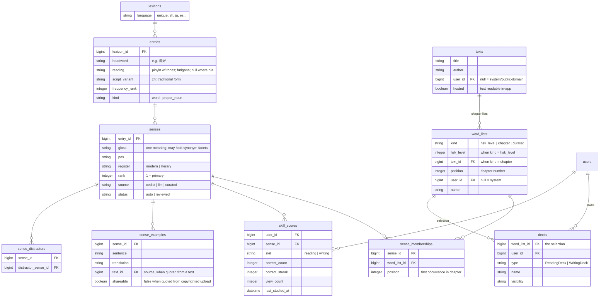

# Compendium

Design for a single shared vocabulary store ("the compendium") that all language
decks select from, replacing per-deck language data_sets. Status: **design only —
nothing here is built.**

## Goals

- One canonical record per word per language. Fixing a gloss fixes it everywhere.
- Decks are *selections over* the compendium, not owners of copied content.
- Progress belongs to the user × word-sense × skill, independent of deck. Studying
  a word in any deck advances the same streak; reading and writing streaks are
  separate.
- Support texts as a first-class source: a book's chapters become word lists, so a
  reader can study a chapter's vocabulary before reading it.
- Multi-language from the start (Mandarin first). Language-specific needs live in
  nullable columns, not Mandarin-shaped tables.
- Sharing by reference: a shared deck is a visibility flag, not a copied data_set.

## Schema

Key uniques:

| Table | Unique on |
|---|---|
| entries | (lexicon_id, headword, reading) |
| senses | — (rank orders within entry) |
| sense_memberships | (sense_id, word_list_id) |
| skill_scores | (user_id, sense_id, skill) |
| sense_distractors | (sense_id, distractor_sense_id) |

## Core concepts

### Entry vs. sense

- **Entry** identity is headword + reading within a lexicon. 还 hái and 还 huán are
  two entries; 花 huā is one entry regardless of meaning.
- **Sense** is the studyable unit — one meaning of an entry. The split criterion:
  *could a learner know one meaning without knowing the other?* 花 flower vs.
  花 to-spend split; "to like" vs. "to be fond of" do not (synonym facets stay
  inside one sense's gloss).
- Over-splitting is tolerated (the seed data is already semicolon-split and can be
  imported as-is). Credit fan-out (below) makes facet-level rows score in lockstep,
  and merging senses later is a local fix: combine rows, keep the max score. The
  cost is cosmetic — inflated "sense counts" on entries.
- Script is a column, not an entry split: simplified is the headword, traditional
  is `script_variant` (per-sense mapping is unambiguous even for one-to-many
  characters like 发, because senses pin the word). Regional *vocabulary*
  differences (软件 vs. 軟體) are separate entries, not script variants.
- Proper nouns (`kind`) are excluded from vocabulary decks by default; a text's
  names belong in a glossary tier, not flashcards.
- `register` keeps literary/archaic senses (e.g. from Journey to the West) from
  polluting modern decks, and vice versa.

### Deck = word_list × form

A deck owns no content: it points at a word_list (HSK level, book chapter, or a
hand-curated list) and contributes the *form* — reading vs. writing (existing STI),
plus study settings. Consequences:

- Sharing a deck is a visibility flag. No copying, no forking of content on add.
  Fork = copy the word_list, only needed to *edit* the selection.
- HSK levels, chapters, and personal lists are one mechanism.
- The current `data_sets`/`items`/`pairings`/`cards` tables are not needed for
  language decks. (Basic and Music decks stay on that machinery for now — their
  progress model is similar but their source data is not; schema follow-up needed.
  No polymorphic tables.)

### Study semantics

- **One card per entry per deck.** If a deck's list contains several senses of one
  entry, study mode presents a single card whose back is the union of those
  senses' glosses, rejoined with "; " — the same display as today. The deck itself
  is the disambiguating context for the prompt (seeing 花 in an HSK 1 deck asks
  for what HSK 1 taught).
- **Credit fans out.** Answering that card correctly advances the streak of every
  member sense. Grouping is a study-time construct; nothing about it is stored.
- **Card due-ness = weakest member sense.** A card mixing a mastered and a new
  sense behaves like a new card.
- **Grading is entry-wide, not membership-wide.** A typed/chosen answer is checked
  against all of the entry's senses (register permitting), and credit lands on the
  sense that matched. A user answering "to like" when the list references only the
  "to be fond of" facet is right, not wrong. This rule is load-bearing: it is what
  makes facet-level rows and narrow chapter memberships safe.
- **Cards are not rows.** A study session enumerates the list's senses, joins the
  user's skill_scores for the deck's skill, and picks what's due. Any user can
  study any visible deck; their progress is their own.

### Progress

`skill_scores` is per user × sense × skill. Reading and writing advance
independently; both persist across every deck containing the sense.

Known wrinkle, deliberately deferred: writing ability is arguably per *entry* (or
per character — writing 银行 is writing 银 + 行) rather than per sense. Keying both
skills to sense is the consistent v1; revisit if writing decks feel wrong.

## Content pipeline (build-time, per text or list)

1. **Segment** the text into words (jieba for modern text; LLM-assisted for
   classical).
2. **Lexicon lookup first** — known senses cost nothing and inherit user progress.
   Lookup indexes both headword and script_variant, so traditional and simplified
   sources both match.
3. **New words → contextual glossing**: the LLM receives the sentence plus the
   CC-CEDICT entry and picks/trims the sense that fits. CEDICT (a ~9 MB reference
   table server-side, never user-facing) is there for gloss *convergence*, cheap
   verification, the not-a-word tripwire, and pinyin — not because the LLM can't
   translate.
4. **Match step**: does an existing sense cover this usage? Link it; otherwise
   create a sense (source: llm, status: auto). The sense inventory grows lazily
   from real usage.
5. **Misses route, they don't fail**: not-in-CEDICT means proper noun (→ name
   tier), segmentation artifact (→ re-segment check), or a real rare word
   (→ ungrounded gloss with heavier checks: "real word / name / artifact?" asked
   explicitly, cross-occurrence agreement, back-translation, review queue).
6. **Chapter word_lists** get sense_memberships with first-occurrence positions;
   dedup against earlier chapters happens by construction (the sense already
   exists and the user may already have scores).

## Seeding

- The existing hand-curated HSK data_sets are the seed: vetted word + level +
  gloss rows. Their semicolon-split glosses import as individual senses (facet
  over-splitting accepted, see above).
- Cross-level gloss differences for the same headword are *signal* — HSK levels
  teach different senses of the same word (花 flower @1, spend @higher). Same
  meaning → merge; different meaning → separate senses with separate level
  memberships.
- HSK official lists carry no sentences or sense annotations; context for
  list-sourced words comes from Tatoeba, level-constrained LLM-generated
  sentences, or community datasets. The existing curated decks double as the
  validation set for the sense engine (diff engine output vs. curation).
- Useful community data: [drkameleon/complete-hsk-vocabulary](https://github.com/drkameleon/complete-hsk-vocabulary)
  (MIT; both HSK versions, frequency, POS, traditional, cleaned CEDICT glosses).

## Progress scoring migration

Existing card progress (`correct_count`, `correct_streak`, `view_count`) must move
to skill_scores keyed by the senses each card's item maps to (fan-out: a card
covering multiple glosses seeds each matched sense's row; conflicts keep max).
Deck type determines skill (ReadingDeck → reading, WritingDeck → writing).

## Open questions

- **Basic / Music progress**: same scoring shape, very different source data.
  Needs its own schema pass; explicitly not solved by this doc (and not via
  polymorphism).
- **Writing skill grain**: sense vs. entry vs. character (see wrinkle above).
- **Missed-words / tap-to-collect lists**: per-user dynamic word_lists (kind:
  missed?) — mechanism sketched, not designed.
- **Word_list governance**: who may edit a system list vs. a user list referenced
  by others' decks; deletion of referenced lists.
- **Gloss language**: glosses are English today; multi-gloss-language support
  would hang off senses later.
- **sense_examples sourcing**: generated vs. Tatoeba vs. quoted-from-text, and the
  shareable flag's interaction with copyrighted uploads.
